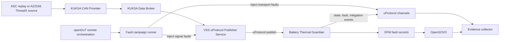
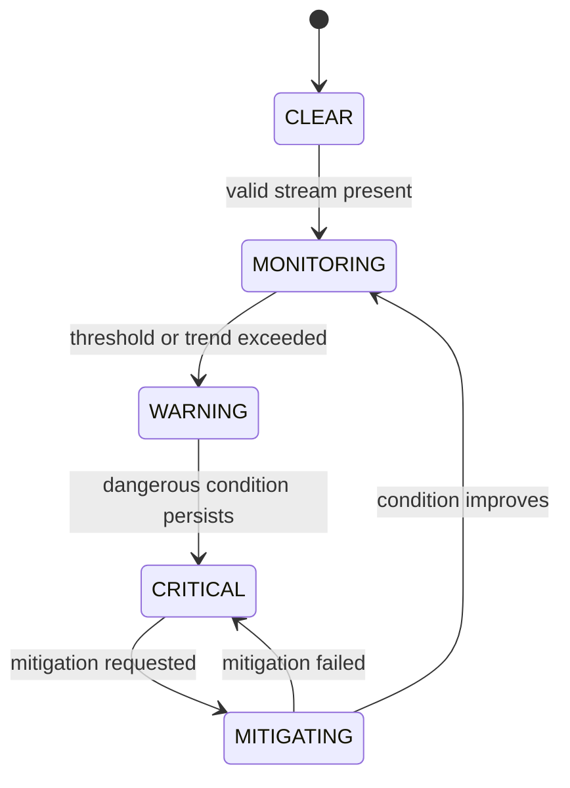
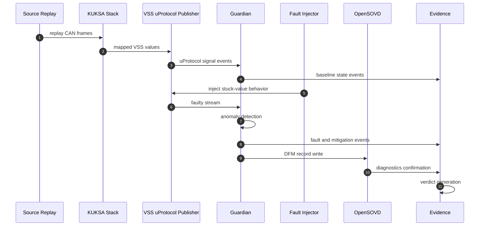

# Doctor Whodunit

> Every fault leaves evidence. Solve the case.

## The Challenge

Something in the vehicle just failed — whodunit?

Travel your system's timeline: inject faults you've seen before or expect in the future, and let the evidence tell the story.

Build a safety evidence factory around the Battery Thermal Guardian — an EV thermal-runaway early-warning service. Regulations require occupants be warned minutes before a battery thermal event turns dangerous, so a stale or stuck cell-temperature signal silently disarms the entire warning chain.

Run the Guardian on an AutoSD-based runtime, supervised by Ankaios, exchanging heartbeat, fault, and mitigation events over uProtocol, with diagnostic truth exposed through OpenSOVD. openDuT replays repeatable fault campaigns at three levels — delayed or duplicated messages, stuck or implausible VSS signals, even device-level sensor dropout — while your evidence collector links hazard → safety goal → injected fault → detection → mitigation → verdict for every test, packaged as a reusable SDV Blueprint.

Doctor Whodunit is therefore not only a detection challenge. It is an evidence challenge. For every scenario, your team should be able to show what fault was injected, what the system observed, which mitigation was triggered, and why the final verdict is PASS, FAIL, or INCONCLUSIVE.

The challenge is designed for software-defined vehicles, so portability and repeatability are part of the core problem. The same Guardian logic should stay valid as your environment evolves from pure simulation to more realistic setups.

## Your Mission

Build a portable Safety Evidence Factory around the Battery Thermal Guardian.

A strong solution demonstrates repeatable fault campaigns, correct Guardian behavior, clear diagnostics, and evidence-backed verdicts that another team can reproduce.

## Target Architecture

The key architecture rule is simple:

VSS data must pass through a uProtocol service interface before reaching the Guardian.

Guardian should not be tightly coupled to direct Data Broker reads.



This keeps service contracts stable while allowing transport and deployment details to change without rewriting business logic.

## Building Blocks

Your implementation should connect the following building blocks into one coherent flow:

| Layer | Component | Role |
|-------|-----------|------|
| **Source** | CAN `.asc` replay (or AZ3166 + ThreadX) | Temperature signal origin |
| **Decode** | KUKSA CAN Provider → Data Broker | CAN-to-VSS mapping |
| **Publish** | VSS uProtocol Publisher | Exposes mapped values over uProtocol |
| **Evaluate** | Battery Thermal Guardian (Rust) | Thermal risk state machine |
| **Orchestrate** | Ankaios | Workload lifecycle, AutoSD HPC target |
| **Diagnose** | DFM → OpenSOVD | Fault records and diagnostic exposure |
| **Campaign** | openDuT | Remote, repeatable fault injection |
| **Collect** | Evidence collector | Correlates metadata → events → diagnostics → verdict |

## Development Journey

Build incrementally instead of trying to solve everything at once.

**Phase 0 — Align**
> Agree on signal names, units, event contracts, campaign metadata, and verdict schema.  
> Early alignment prevents most late-stage integration issues.

**Phase 1 — Baseline**
> Make the nominal path work end-to-end:
>
> `source` → `KUKSA CAN Provider` → `Data Broker` → `VSS uProtocol Publisher` → `Guardian`
>
> Focus on: scaling correctness, timestamp monotonicity, stable state transitions.

**Phase 2 — Fault Campaigns**
> - Introduce one transport fault and one signal fault
> - Add source faults and combined scenarios
> - Measure detection latency, mitigation timing, and state behavior per run

**Phase 3 — Diagnostics Correlation**
> - Verify DFM records are created for each faulted scenario
> - Confirm OpenSOVD exposes matching diagnostics
> - Tie runtime events back with correlation identifiers

**Phase 4 — Remote Reruns**
> - Execute selected scenarios remotely with openDuT
> - Compare verdict consistency across reruns

**Phase 5 — Orchestrated Demo**
> - Run full system under Ankaios orchestration
> - Demonstrate restart/recovery without breaking evidence integrity

## Suggested Guardian Behavior

Keep the first version simple, then evolve it.



A minimal state machine like this is enough for a strong submission if behavior and evidence are consistent.

## Typical Scenario Timeline



This is the pattern you should be able to reproduce for each campaign variant.

## Fault Classes to Cover

Your campaign set should include:

| Class | Examples |
|-------|----------|
| **Transport** | delay · duplicate · drop · reorder |
| **Signal** | stuck value · spike · drift · out-of-range |
| **Source** | dropout · replay interruption |
| **Diagnostics** | delayed DFM write · partial OpenSOVD visibility |

## Suggested Challenge Levels

Use these levels to scope progress and communicate maturity:

| Level | Milestone | Description |
|:-----:|-----------|-------------|
| ⭐ | **Baseline** | Stable nominal behavior, end-to-end signal flow |
| ⭐⭐ | **Single-layer faults** | One transport + one signal fault with measurable response |
| ⭐⭐⭐ | **Combined faults** | Multi-fault scenarios with full diagnostics correlation |
| ⭐⭐⭐⭐ | **Remote reruns** | openDuT-triggered campaigns with consistency proof |
| ⭐⭐⭐⭐⭐ | **Blueprint** | Reusable package another team can execute |

## Bonus Behavior

🎯 **Bonus credits are optional and independent.**

Teams may complete either one, or both:

- **Bonus A:** Guardian implemented using S-CORE aligned patterns
- **Bonus B:** Implementation runs successfully on AutoSD

If both are completed, teams receive both bonus credits.

## Recommended Demo Criteria

A good final demo is short and evidence-driven:

1. **Baseline run** → nominal behavior confirmed
2. **Transport fault** → e.g., delayed message, measurable detection
3. **Signal fault** → e.g., stuck value, state transition triggered
4. **Diagnostics correlation** → DFM record ↔ OpenSOVD exposure
5. **Remote rerun** → same scenario via openDuT, consistent verdict
6. **Verdict report** → clear PASS / FAIL / INCONCLUSIVE with evidence links

## Definition of Done

A complete solution should satisfy all of the following:

- [ ] Guardian receives VSS data through uProtocol
- [ ] Fault campaigns are deterministic and replayable
- [ ] Detection and mitigation timing is measurable
- [ ] DFM records exist for faulted scenarios
- [ ] OpenSOVD exposes matching diagnostics
- [ ] Evidence chain is complete: hazard → safety goal → fault → detection → mitigation → verdict
- [ ] openDuT can trigger remote reruns
- [ ] Ankaios manages the final orchestrated run
- [ ] Another team can replay scenarios with minimal setup changes

## What Not to Do

| ❌ Avoid | Why |
|----------|-----|
| Coupling Guardian to CAN decoding internals | Breaks portability |
| Bypassing uProtocol for Guardian input | Violates architecture rule |
| Hard-coding machine-specific assumptions | Prevents reproducibility |
| Publishing verdicts without diagnostics | Evidence chain incomplete |
| Relying on one-off manual runs | Cannot be replayed |
| Hiding failed scenarios | Undermines safety argument |

## Student Quick Start

If you are starting from scratch, use this sequence:

1. Get baseline replay running end-to-end.
2. Validate CAN decode and VSS mapping.
3. Publish mapped VSS values over uProtocol.
4. Subscribe Guardian and verify state behavior.
5. Inject one transport fault and one signal fault.
6. Add DFM and OpenSOVD correlation checks.
7. Rerun one scenario remotely using openDuT.
8. Generate a final evidence-backed verdict report.

## Suggested Submission Structure

```text
submission/
  architecture/
  campaigns/
  mappings/
  runtime/
  diagnostics/
  evidence/
  demo/
  README.md
```

## Projects in Scope

| Project | Role |
|---------|------|
| [**openDuT**](https://github.com/eclipse-opendut/opendut) | Remote fault campaign orchestration |
| [**uProtocol**](https://github.com/eclipse-uprotocol) | Service-layer messaging |
| [**Ankaios**](https://github.com/eclipse-ankaios/ankaios) | Workload lifecycle management |
| [**OpenSOVD**](https://github.com/eclipse-opensovd) | Diagnostic exposure |
| [**KUKSA**](https://github.com/eclipse-kuksa) | CAN Provider + Data Broker |
| [**AutoSD**](https://sig.centos.org/automotive/autosd-10/) | HPC runtime target |
| [**S-CORE**](https://github.com/eclipse-score) | Safety-aligned patterns (bonus) |
| [**SDV Blueprints**](https://sdv-blueprints.eclipse.dev/) | Reusable packaging format |

## Prerequisites

- 🦀 Basic **Rust** or 🐍 **Python**
- 🐧 Linux and containers
- 📡 Pub/sub messaging basics

## Final Question

Can your Guardian detect and react safely when thermal data is unreliable, and can you prove that verdict with traceable evidence another team can reproduce?

If yes, you solved Doctor Whodunit.
