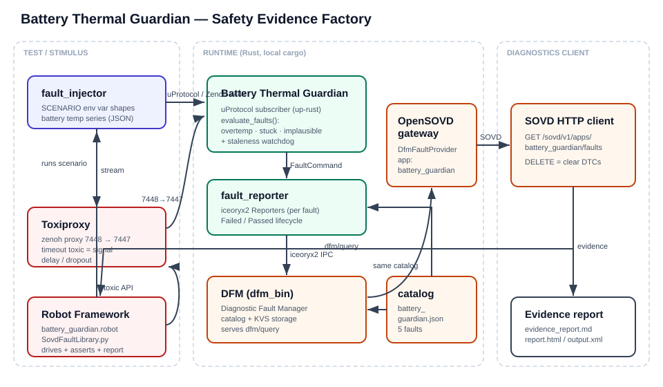

# Documentation — Battery Thermal Guardian Safety Evidence Factory

This folder documents the demo that wires the **Battery Thermal Guardian** to a
**Diagnostic Fault Manager (DFM)**, exposes its faults through the **OpenSOVD**
gateway, and produces a **safety evidence report** from automated fault-injection
tests.

- [Architecture](#architecture)
- [How it works](#how-it-works)
- [Setup](#setup)
- [Step-by-step walkthrough](#step-by-step-walkthrough)
- [Example report](#example-report)
- [Troubleshooting](#troubleshooting)

---

## Architecture



If your viewer does not render the SVG, the same architecture in Mermaid:

```mermaid
flowchart LR
  subgraph TEST["Test / stimulus"]
    ROBOT["Robot Framework<br/>battery_guardian.robot<br/>SovdFaultLibrary.py"]
    INJ["fault_injector<br/>(SCENARIO env)"]
    TOXI["Toxiproxy<br/>zenoh 7448 → 7447"]
  end

  subgraph RUNTIME["Runtime (Rust, local cargo)"]
    GUARD["Battery Thermal Guardian<br/>evaluate_faults + watchdog"]
    REP["fault_reporter<br/>iceoryx2 Reporters"]
    DFM["DFM (dfm_bin)<br/>catalog + KVS storage"]
    GW["OpenSOVD gateway<br/>app: battery_guardian"]
  end

  subgraph CLIENT["Diagnostics client"]
    SOVD["SOVD HTTP<br/>/sovd/v1/apps/battery_guardian/faults"]
    RPT["Evidence report<br/>evidence_report.md + report.html"]
  end

  ROBOT -->|runs scenario| INJ
  ROBOT -->|toxic API| TOXI
  INJ -->|uProtocol / Zenoh 7447| GUARD
  INJ -->|uProtocol stream| TOXI
  TOXI -->|Zenoh 7448→7447| GUARD
  GUARD -->|FaultCommand| REP
  REP -->|iceoryx2 IPC| DFM
  DFM -->|dfm/query| GW
  GW -->|SOVD| SOVD
  SOVD -->|assert + evidence| ROBOT
  SOVD --> RPT
```



### Components

| Component | Path | Role |
|---|---|---|
| Fault injector    | `services/src/bin/fault_injector.rs` | Publishes `BatteryTempEvent` (uProtocol/Zenoh) shaped per `SCENARIO` |
| Guardian          | `services/src/bin/guardian.rs`       | Detects overtemp / stuck / implausible / stale conditions |
| Fault reporter    | `services/src/fault_reporter.rs`     | Bridges Guardian detection → DFM over iceoryx2 IPC |
| Fault catalog     | `diagnostics/catalog/battery_guardian.json` | Declares the 5 faults (shared by Guardian and DFM) |
| DFM               | `fault-lib/` (`dfm_bin`)             | Stores fault lifecycle, serves `dfm/query` |
| OpenSOVD gateway  | `opensovd-core/`                     | Serves faults over SOVD HTTP as app `battery_guardian` |
| Robot suite       | `tests/battery_guardian.robot`       | Injects faults, asserts, generates report |
| Robot library     | `tests/SovdFaultLibrary.py`          | Injection, Toxiproxy control, SOVD polling, report rendering |
| Orchestrator      | `scripts/run_demo.sh`                | Build → launch → test → teardown |

### Ports

| Port | Service |
|---|---|
| 7447 | Zenoh endpoint the Guardian listens on |
| 7448 | Toxiproxy proxy for the Zenoh link (transport faults) |
| 7690 | OpenSOVD gateway HTTP (`/sovd`) |
| 8080 | Guardian HTTP (`/health`, `/state`) |
| 8474 | Toxiproxy control API |

---

## How it works

1. **Signal in.** `fault_injector` publishes a battery-temperature series over
   uProtocol/Zenoh. Each `SCENARIO` shapes the signal to exercise one fault
   class (or none, for the baseline).

2. **Detection.** The Guardian subscribes to the temperature events and runs
   `evaluate_faults()` on every sample:
   - `BatteryOverTempWarning` — temp ≥ 45 °C
   - `BatteryOverTempCritical` — temp ≥ 55 °C
   - `BatteryTempSignalStuck` — value unchanged across ≥ 5 samples
   - `BatteryTempImplausible` — out of −40..125 °C, or a jump > 20 °C
   - `BatteryTempSignalStale` — a background watchdog fires when no fresh sample
     arrives within 2 s (delayed/dropped signal)

3. **Reporting.** State changes are handed to `fault_reporter`, which owns one
   iceoryx2 `Reporter` per fault and publishes `Failed`/`Passed` lifecycle
   records to the DFM. At startup it publishes an all-clear baseline so the
   diagnostic store is immediately queryable.

4. **Fault management.** `dfm_bin` maintains the fault/DTC state (catalog +
   persistent KVS storage) and serves it on the `dfm/query` IPC service.

5. **Diagnostics interface.** The OpenSOVD gateway attaches a `DfmFaultProvider`
   for the app `battery_guardian` and serves the faults over HTTP:
   `GET /sovd/v1/apps/battery_guardian/faults`. `DELETE` on the same path clears
   sticky DTC state.

6. **Test + evidence.** The Robot suite resets state, injects each scenario,
   polls OpenSOVD until the expected fault appears, records the SOVD snapshot,
   and renders the Markdown evidence report plus Robot's HTML report.

### Transport stack (uProtocol over Zenoh)

The producer→Guardian link uses **Eclipse uProtocol** (via the `up-rust`
library) for addressing and messaging, carried over a **Zenoh** transport.
Payloads are JSON `BatteryTempEvent` messages published to a VSS-style URI
(`//battery-vss/9001/1/9001`). The injector is a uProtocol publisher; the
Guardian registers a uProtocol listener on that URI (`ZENOH_LISTEN=tcp/127.0.0.1:7447`,
publishers use `ZENOH_CONNECT`). Because this is real pub/sub over Zenoh, the
link can be intercepted by Toxiproxy at the TCP layer (`7448 → 7447`) to emulate
delayed or dropped signals without changing any application code.

### Transport-fault injection

The **transport delay** scenario is different from the signal-level ones: the
injector keeps publishing valid samples, but Robot adds a **Toxiproxy** `timeout`
toxic to the Zenoh proxy (`7448 → 7447`). Fresh samples stop reaching the
Guardian, so the freshness watchdog raises `BatteryTempSignalStale` — proving the
Guardian detects a delayed/dropped CAN-derived signal at the transport layer.

---

## Setup

### Prerequisites

- **Rust** toolchain (build the services, DFM, and gateway)
- **protoc** — `sudo apt-get install -y protobuf-compiler` (KUKSA proto build)
- **Python 3** with Robot Framework:
  ```bash
  pip install robotframework requests
  ```
- **Toxiproxy** binaries — bundled in `demo/.tools/` (`toxiproxy-server`,
  `toxiproxy-cli`). No Docker required.

### One command

From the `demo/` directory:

```bash
scripts/run_demo.sh            # build everything, run the stack + tests, tear down
scripts/run_demo.sh --no-build # skip cargo builds (binaries already built)
```

Artifacts are written to `demo/reports/`:

| File | Description |
|---|---|
| `evidence_report.md` | Safety evidence report (hazard → fault → OpenSOVD → verdict) |
| `report.html` / `log.html` | Robot Framework run report |
| `output.xml` | Machine-readable Robot results |

Runtime logs go to `/tmp/dr-whodunit/` (`dfm.log`, `guardian.log`,
`gateway.log`, `toxiproxy.log`).

---

## Step-by-step walkthrough

Prefer to run it by hand? This is exactly what `scripts/run_demo.sh` automates.

### 1. Build

```bash
cd demo
(cd fault-lib && cargo build --bin dfm_bin)
cargo build -p dr-whodunit-services --bin guardian --bin fault_injector
(cd opensovd-core && cargo build -p opensovd-gateway --features fault-lib)
```

### 2. Start the DFM

```bash
mkdir -p /tmp/dr-whodunit/dfm-storage
./fault-lib/target/debug/dfm_bin \
  --catalog-dir "$PWD/diagnostics/catalog" \
  --storage-dir /tmp/dr-whodunit/dfm-storage &
```

> Both `--catalog-dir` **and** `--storage-dir` are required; without the storage
> dir the DFM exits immediately.

### 3. Start the Guardian

```bash
FAULT_CATALOG="$PWD/diagnostics/catalog/battery_guardian.json" \
SOVD_ENTITY=battery_guardian PORT=8080 ZENOH_LISTEN=tcp/127.0.0.1:7447 \
  ./target/debug/guardian &
curl -s http://127.0.0.1:8080/health   # 200 when ready
```

### 4. Start the OpenSOVD gateway

```bash
./opensovd-core/target/debug/opensovd-gateway --dfm-fault-app battery_guardian &
# Faults are now served (all clear):
curl -s http://127.0.0.1:7690/sovd/v1/apps/battery_guardian/faults | python3 -m json.tool
```

### 5. Start Toxiproxy and the Zenoh proxy (only needed for transport faults)

```bash
./.tools/toxiproxy-server &
curl -s -X POST http://127.0.0.1:8474/proxies \
  -H 'Content-Type: application/json' \
  -d '{"name":"zenoh","listen":"127.0.0.1:7448","upstream":"127.0.0.1:7447","enabled":true}'
```

### 6. Inject a fault manually (example: overtemperature)

```bash
SCENARIO=overtemp ZENOH_CONNECT=tcp/127.0.0.1:7447 ./target/debug/fault_injector
# Watch the fault appear on OpenSOVD:
curl -s http://127.0.0.1:7690/sovd/v1/apps/battery_guardian/faults \
  | python3 -c "import sys,json;[print(f['code'], f['status']['testFailed']) for f in json.load(sys.stdin)['items']]"
```

Reset between scenarios:

```bash
curl -s -X DELETE http://127.0.0.1:7690/sovd/v1/apps/battery_guardian/faults
```

Available scenarios (`SCENARIO=`): `nominal`, `overtemp`, `stuck`, `spike`,
`stale`, `stream` (long, safe stream used with Toxiproxy).

### 7. Run the automated suite + report

```bash
cd tests
python3 -m robot --outputdir ../reports battery_guardian.robot
```

---

## Example report

A full sample is checked in at [`example-report.md`](example-report.md). The
scenario results table looks like this:

| Scenario | Injected condition | Expected fault(s) | OpenSOVD observed | Verdict |
|---|---|---|---|---|
| Baseline          | Nominal temperature ramp (30..44 C)         | _none_ | _none (clear)_ | PASS |
| Overtemperature   | Temp ramp through 45 C / 55 C               | `BatteryOverTempWarning`, `BatteryOverTempCritical` | `BatteryOverTempCritical`, `BatteryOverTempWarning` | PASS |
| Stuck signal      | Frozen temperature value (40 C repeated)    | `BatteryTempSignalStuck` | `BatteryTempSignalStuck` | PASS |
| Implausible spike | Out-of-range spike (300 C)                  | `BatteryTempImplausible` | `BatteryTempImplausible` | PASS |
| Source dropout    | Publisher stops (no fresh samples)          | `BatteryTempSignalStale` | `BatteryTempSignalStale` | PASS |
| Transport delay   | Zenoh link blackholed (delayed/dropped)     | `BatteryTempSignalStale` | `BatteryTempSignalStale` | PASS |

Each scenario also captures the raw OpenSOVD fault status (an appendix in the
report), e.g. for the overtemperature case:

| Fault code | testFailed | confirmedDtc | warningIndicator |
|---|---|---|---|
| `BatteryOverTempCritical` | True  | True  | True  |
| `BatteryOverTempWarning`  | True  | True  | True  |
| `BatteryTempImplausible`  | False | False | False |
| `BatteryTempSignalStale`  | False | False | True  |
| `BatteryTempSignalStuck`  | False | False | False |

---

## Troubleshooting

| Symptom | Cause / fix |
|---|---|
| Gateway `GET .../faults` returns **503** | DFM not up or store empty. Ensure `dfm_bin` started with `--storage-dir`, and the Guardian connected (it publishes an all-clear baseline at startup). |
| Guardian log: `DFM not ready ... retrying` | The DFM isn't running (often a missing `--storage-dir`). Start the DFM first. |
| `DELETE .../faults` returns **503 KeyNotFound** | Harmless — the store was already clear. The first `DELETE` returns 204. |
| Faults from a previous run persist | Wipe the DFM storage dir (`scripts/run_demo.sh` does this automatically each run). |
| `protoc` / proto build errors | `sudo apt-get install -y protobuf-compiler`. |
| Robot cannot import library | `pip install robotframework requests`. |
