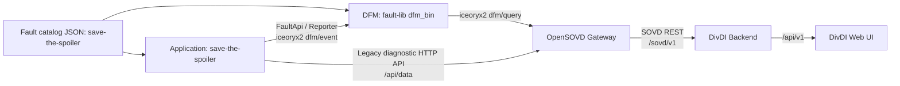
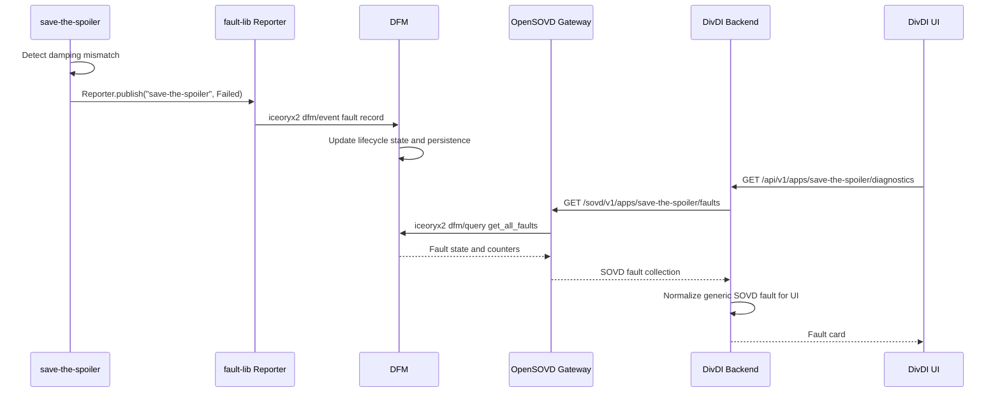
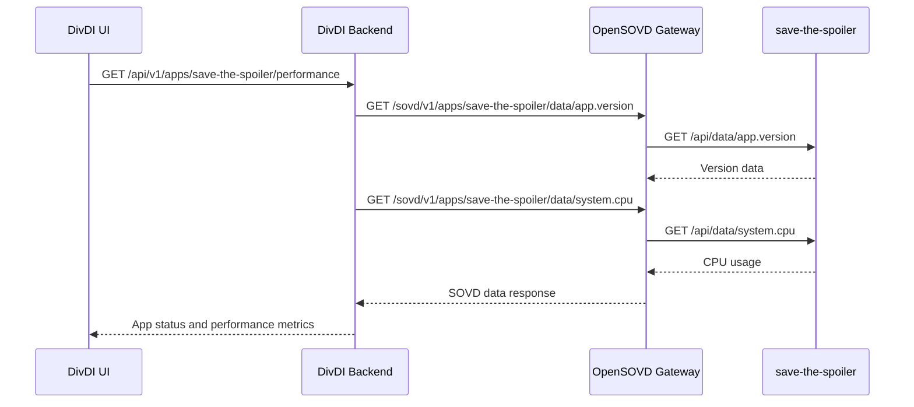
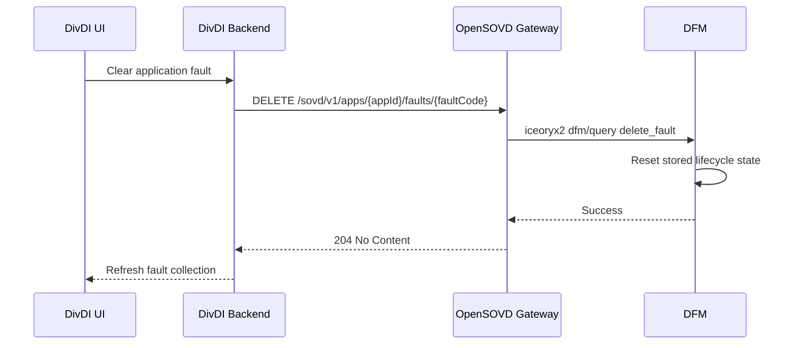
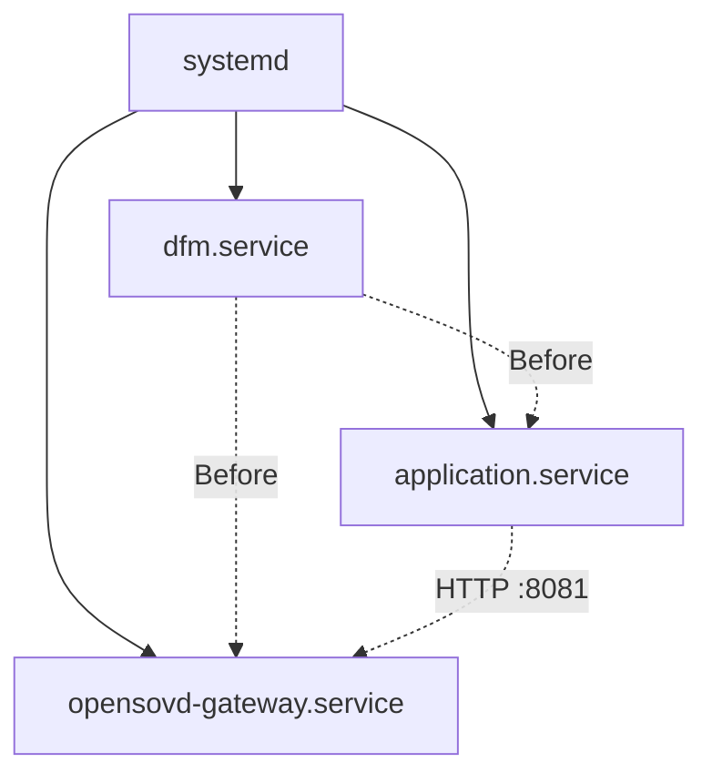

# DFM, OpenSOVD, and DivDI End-to-End Flow

## Purpose

This document describes the native embedded deployment flow for faults reported
by an application, stored by fault-lib's Diagnostic Fault Manager (DFM), exposed
by OpenSOVD Gateway, and displayed in the DivDI web application.

The `save-the-spoiler` application is a working example. The flow is generic:
every application owns its own SOVD app ID and DFM catalog path.

## Runtime Components

| Component | Responsibility | Interface |
|---|---|---|
| Application | Detects a local failure and reports lifecycle state changes | fault-lib reporter, diagnostic HTTP API |
| fault-lib | Reporter-side validation and IPC transport | iceoryx2 IPC |
| DFM (`dfm_bin`) | Fault lifecycle state and persistence | iceoryx2 `dfm/event`, `dfm/query` |
| OpenSOVD Gateway | App data and fault SOVD collections | HTTP `:7690/sovd/v1` |
| DivDI backend | SOVD-to-UI API adapter | HTTP `:3001/api/v1` |
| DivDI frontend | Status, data, and fault presentation | Browser `:5173` |

## System Context



## Entity and Catalog Mapping

Every fault belongs to an **application**, not automatically to its host
component.

| Concept | Example value |
|---|---|
| OpenSOVD component ID | `ecu` |
| OpenSOVD app ID | `save-the-spoiler` |
| DFM catalog ID / report path | `save-the-spoiler` |
| Fault code | `spoiler.damping.mismatch` |

The gateway declares the application as hosted on the component and attaches a
DFM provider to the application ID:

```text
--legacy-http-app 'save-the-spoiler|Save-the-Spoiler|ecu|http://127.0.0.1:8081/api'
--dfm-fault-app save-the-spoiler
```

The application fault collection is:

```text
GET /sovd/v1/apps/save-the-spoiler/faults
```

It is intentionally distinct from the component collection:

```text
GET /sovd/v1/components/ecu/faults
```

The component collection is empty unless the component itself has a provider
attached with `--dfm-fault-component ecu`.

## Fault Reporting Sequence

The example detects a damping mismatch when automatic control is disabled and
the actual damping does not match the geofence safety setting.



## Data and Liveness Sequence

The application publishes a diagnostic API at `http://127.0.0.1:8081/api`.
The gateway's legacy HTTP app provider exposes this data through standard SOVD
app data routes.



DivDI determines generic liveness using these standard app data IDs:

1. `app.status`
2. `app.version`

An application responding to either value is displayed as `alive`. DivDI does
not depend on application-specific IDs.

## Clear Fault Sequence

Clearing a fault resets lifecycle state; it does not remove the catalog
descriptor. DFM can therefore continue returning the fault with healthy status
and reset counters, depending on lifecycle policy.



## Native AArch64 Deployment

Run all services as native AArch64 binaries under the same operating-system user
because fault-lib uses iceoryx2 IPC.



Startup order:

1. Start `dfm_bin` with the directory containing application fault catalogs.
2. Start the application.
3. Start OpenSOVD Gateway with each declared legacy app and DFM app provider.
4. Configure DivDI with `SOVD_CORE_URL=http://<embedded-host>:7690/sovd/v1`.

## Example Commands

```bash
# DFM
dfm_bin \
  --catalog-dir /opt/opensovd/catalogs \
  --storage-dir /var/lib/dfm

# Application
save-the-spoiler

# Gateway
opensovd-gateway \
  --url http://0.0.0.0:7690/sovd \
  --legacy-http-app 'save-the-spoiler|Save-the-Spoiler|ecu|http://127.0.0.1:8081/api' \
  --dfm-fault-app save-the-spoiler
```

## Verification Endpoints

| Purpose | Endpoint |
|---|---|
| Registered applications | `GET /sovd/v1/apps` |
| App identity and liveness | `GET /sovd/v1/apps/save-the-spoiler/data/app.version` |
| App metrics | `GET /sovd/v1/apps/save-the-spoiler/data/system.cpu` |
| Application faults | `GET /sovd/v1/apps/save-the-spoiler/faults` |
| DivDI diagnostics | `GET /api/v1/apps/save-the-spoiler/diagnostics` |
| DivDI fault list | `GET /api/v1/apps/save-the-spoiler/faults` |
