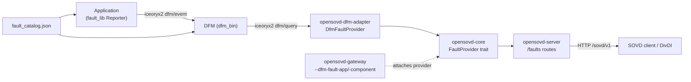

# Reading Faults from DFM — Integration Guide

Complete, self-contained knowledge dump for the "read faults from DFM" feature:
what it is, every file it touches, how to wire a **new application** to it, how
that application reports faults, and how to build/run/verify the end-to-end flow.

This guide is repo-agnostic. It documents the reference implementation that lives
in this repository so the same capability can be reproduced in another repo with
a different application (not `save-the-spoiler`).

- Companion design doc (data flow + sequences): [dfm-divdi-end-to-end-flow.md](./dfm-divdi-end-to-end-flow.md)
- Reusable fault catalog template: [../../examples/dfm-faults/fault_catalog.json](../../examples/dfm-faults/fault_catalog.json)

---

## 1. Contents

1. [Two sides: reading vs reporting](#2-two-sides-reading-vs-reporting)
2. [Architecture](#3-architecture)
3. [Changeset inventory](#4-changeset-inventory)
4. [Wiring edits in detail](#5-wiring-edits-in-detail)
5. [The `DfmFaultProvider` adapter API](#6-the-dfmfaultprovider-adapter-api)
6. [Fault data model & mapping](#7-fault-data-model--mapping)
7. [SOVD endpoints exposed](#8-sovd-endpoints-exposed)
8. [Integrating a NEW application](#9-integrating-a-new-application)
9. [The fault catalog JSON](#10-the-fault-catalog-json)
10. [The reporting side (app publishes faults)](#11-the-reporting-side-app-publishes-faults)
11. [Build, run & verify](#12-build-run--verify)
12. [Dependencies & feature flags](#13-dependencies--feature-flags)
13. [Environment & build constraints](#14-environment--build-constraints)
14. [Scope decisions & exclusions](#15-scope-decisions--exclusions)
15. [Verification status](#16-verification-status)

---

## 2. Two sides: reading vs reporting

DFM (Diagnostic Fault Manager, from `fault-lib`) sits between applications and
diagnostics. There are two independent integration surfaces:

| Side | Who | Crate(s) | Transport | This feature |
|---|---|---|---|---|
| **Reporting** | The application | `fault_lib`, `common` (reporter) | iceoryx2 `dfm/event` | App-owned (see §11) |
| **Reading** | OpenSOVD Gateway/Server | `dfm_lib` (query) via `opensovd-dfm-adapter` | iceoryx2 `dfm/query` | **Ported here** (§4–§8) |

The **reading** side is what this repository integrates: OpenSOVD exposes DFM
fault state as SOVD REST collections. The **reporting** side lives inside each
application and is documented in §11 so a new app can emit faults DFM will store.

Both sides share one **fault catalog JSON** (§10).

---

## 3. Architecture



Reading-path responsibilities:

- `opensovd-dfm-adapter` — wraps `dfm_lib`'s query API; implements the core
  `FaultProvider` trait; converts `dfm_lib::SovdFault` → `opensovd_core::Fault`.
- `opensovd-core` — defines the `FaultProvider` trait + fault domain types, and
  lets a `Topology` attach a provider to an app or component.
- `opensovd-models` — SOVD wire (JSON) models for faults.
- `opensovd-server` — HTTP routes that call the provider and serialize models.
- `opensovd-gateway` — CLI flags that connect a `DfmFaultProvider` to entities.

---

## 4. Changeset inventory

Everything below is additive; existing behavior is untouched when the
`fault-lib` feature is off.

### New files

| File | Purpose |
|---|---|
| `opensovd-dfm-adapter/Cargo.toml` | New crate manifest (git dep on `dfm_lib`). |
| `opensovd-dfm-adapter/src/lib.rs` | `DfmFaultProvider<Q>` + `SovdFault`→`Fault` mapping. |
| `opensovd-core/src/fault.rs` | `Fault`, `FaultStatus`, `FaultError`, `FaultResult`, `FaultProvider` trait. |
| `opensovd-models/src/fault.rs` | SOVD JSON models: `Fault`, `FaultStatus`, `Faults`. |
| `opensovd-server/src/routes/fault.rs` | 8 handlers (app/component × list/get/clear_all/clear) + tests. |
| `docs/design/dfm-divdi-end-to-end-flow.md` | End-to-end flow + sequences. |
| `docs/design/dfm-fault-integration-overview.{svg,png}` | Overview diagram. |

### Modified files (wiring only)

| File | Change |
|---|---|
| `Cargo.toml` (workspace) | Add member + `workspace.dependencies` entry for the adapter. |
| `opensovd-core/src/lib.rs` | `mod fault;` + re-export fault types. |
| `opensovd-core/src/topology.rs` | `set_component_fault_provider` / `set_app_fault_provider`. |
| `opensovd-core/src/entity/app.rs` | `fault_provider` field + builder + accessor. |
| `opensovd-core/src/entity/component.rs` | Same additive pattern as `app.rs`. |
| `opensovd-models/src/lib.rs` | `pub mod fault;`. |
| `opensovd-server/src/routes/mod.rs` | `mod fault;` + merge `fault::routes`. |
| `opensovd-server/src/routes/error.rs` | Map `FaultError` → HTTP status. |
| `opensovd-server/src/routes/entities/app.rs` | Advertise `faults` capability link. |
| `opensovd-server/src/routes/entities/component.rs` | Same. |
| `opensovd-cli/gateway/Cargo.toml` | `fault-lib` feature + optional adapter dep. |
| `opensovd-cli/gateway/src/cli.rs` | `--dfm-fault-component` / `--dfm-fault-app`. |
| `opensovd-cli/gateway/src/main.rs` | `attach_dfm_fault_providers` (feature-gated). |
| `Cargo.lock` | New dependency entries only. |

> **Note:** `opensovd-models/src/discovery.rs` already carries the SOVD `faults`
> capability field upstream, so no change is required there.

---

## 5. Wiring edits in detail

### 5.1 Workspace `Cargo.toml`

```toml
members = [ ..., "opensovd-dfm-adapter", ... ]

[workspace.dependencies]
opensovd-dfm-adapter = { path = "opensovd-dfm-adapter" }
```

### 5.2 `opensovd-core/src/lib.rs`

```rust
mod fault;

pub use fault::{Fault, FaultError, FaultProvider, FaultResult, FaultStatus};
```

### 5.3 `opensovd-core` entities (`entity/app.rs`, `entity/component.rs`)

Each entity gains an optional provider, a builder, a crate-internal setter, and
an accessor:

```rust
use crate::fault::FaultProvider;

// struct field
fault_provider: Option<Box<dyn FaultProvider>>,

#[must_use]
pub fn with_fault_provider(mut self, provider: impl FaultProvider) -> Self {
    self.fault_provider = Some(Box::new(provider));
    self
}

pub(crate) fn set_fault_provider(&mut self, provider: Box<dyn FaultProvider>) {
    self.fault_provider = Some(provider);
}

#[must_use]
pub fn fault_provider(&self) -> Option<&dyn FaultProvider> {
    self.fault_provider.as_deref()
}
```

(Also add the field to `new()` initialization and the `Debug` impl.)

### 5.4 `opensovd-core/src/topology.rs`

Add to the `TopologyWriteGuard` impl (these use the private `components`/`apps`
`IndexMap`s, accessible in-module):

```rust
pub fn set_component_fault_provider(
    &mut self, id: &str, provider: Box<dyn FaultProvider>,
) -> Result<()> {
    let component = self.state.components.get_mut(id)
        .ok_or_else(|| TopologyError::NotFound(EntityRef::component(id)))?;
    component.set_fault_provider(provider);
    Ok(())
}

pub fn set_app_fault_provider(
    &mut self, id: &str, provider: Box<dyn FaultProvider>,
) -> Result<()> {
    let app = self.state.apps.get_mut(id)
        .ok_or_else(|| TopologyError::NotFound(EntityRef::app(id)))?;
    app.set_fault_provider(provider);
    Ok(())
}
```

### 5.5 `opensovd-server/src/routes/mod.rs`

```rust
mod fault;

let v1_routes = Router::new()
    .merge(entities::routes::<V>())
    .merge(data::routes::<V>())
    .merge(fault::routes::<V>());
```

### 5.6 `opensovd-server/src/routes/error.rs`

```rust
use opensovd_core::{DataError, FaultError, TopologyError};

// enum variant
#[error(transparent)]
Fault(#[from] FaultError),

// into_response match arm
Self::Fault(e) => {
    let status = match e {
        FaultError::NotFound(_)    => StatusCode::NOT_FOUND,
        FaultError::BadRequest(_)  => StatusCode::BAD_REQUEST,
        FaultError::Unavailable(_) => StatusCode::SERVICE_UNAVAILABLE,
        FaultError::Internal(_)    => StatusCode::INTERNAL_SERVER_ERROR,
    };
    let message = match e {
        FaultError::Internal(msg) => {
            tracing::error!(target: "srv", error = %msg, "Internal error");
            "An internal error occurred".to_string()
        }
        _ => e.to_string(),
    };
    (status, GenericError::new(ErrorCode::ErrorResponse, message))
}
```

### 5.7 `opensovd-server/src/routes/entities/{app,component}.rs`

Advertise the faults collection when a provider is attached:

```rust
let faults = entity
    .fault_provider()
    .map(|_| format!("{base}/apps/{}/faults", encode_path_segment(&app_id)).into());
// ...then add `faults,` to the EntityCapabilities { .. } literal
```

### 5.8 Gateway (`opensovd-cli/gateway`)

`Cargo.toml`:

```toml
[features]
fault-lib = ["dep:opensovd-dfm-adapter"]

[dependencies]
opensovd-dfm-adapter = { workspace = true, optional = true }
```

`src/cli.rs` (feature-gated fields):

```rust
#[cfg(feature = "fault-lib")]
#[arg(long = "dfm-fault-component", value_name = "ID", env = "SOVD_DFM_FAULT_COMPONENT")]
pub dfm_fault_components: Vec<String>,

#[cfg(feature = "fault-lib")]
#[arg(long = "dfm-fault-app", value_name = "ID", env = "SOVD_DFM_FAULT_APP")]
pub dfm_fault_apps: Vec<String>,
```

`src/main.rs` — `configure_topology` becomes fallible and attaches providers:

```rust
#[cfg(feature = "fault-lib")]
attach_dfm_fault_providers(&topology, &cli.dfm_fault_components, &cli.dfm_fault_apps).await?;

#[cfg(feature = "fault-lib")]
async fn attach_dfm_fault_providers(
    topology: &Topology, component_ids: &[String], app_ids: &[String],
) -> anyhow::Result<()> {
    use opensovd_dfm_adapter::DfmFaultProvider;
    let mut guard = topology.write().await;
    for id in component_ids {
        let provider = DfmFaultProvider::connect(id)
            .map_err(|e| anyhow::anyhow!("DFM provider for component {id}: {e}"))?;
        guard.set_component_fault_provider(id, Box::new(provider))?;
    }
    for id in app_ids {
        let provider = DfmFaultProvider::connect(id)
            .map_err(|e| anyhow::anyhow!("DFM provider for app {id}: {e}"))?;
        guard.set_app_fault_provider(id, Box::new(provider))?;
    }
    Ok(())
}
```

---

## 6. The `DfmFaultProvider` adapter API

`opensovd-dfm-adapter/src/lib.rs`:

```rust
pub struct DfmFaultProvider<Q> { /* Arc<Q> query + entity_path */ }

impl<Q> DfmFaultProvider<Q> {
    // Generic constructor: inject any DfmQueryApi (useful for tests/custom IPC).
    pub fn new(query: Arc<Q>, entity_path: impl Into<String>) -> Self;
}

impl DfmFaultProvider<Iceoryx2DfmQuery> {
    // Connects to the DFM `dfm/query` iceoryx2 service. Linux-only.
    pub fn connect(entity_path: impl Into<String>) -> FaultResult<Self>;
}

#[async_trait]
impl<Q: DfmQueryApi + Send + Sync + 'static> FaultProvider for DfmFaultProvider<Q> {
    async fn list(&self) -> FaultResult<Vec<Fault>>;
    async fn get(&self, code: &str) -> FaultResult<(Fault, BTreeMap<String, String>)>;
    async fn clear_all(&self) -> FaultResult<()>;
    async fn clear(&self, code: &str) -> FaultResult<()>;
}
```

Key points:

- Blocking `dfm_lib` calls run inside `tokio::task::spawn_blocking`.
- `entity_path` is the **DFM catalog / report path** (see §9 mapping).
- Error mapping: `BadArgument`→`BadRequest`, `NotFound`→`NotFound`,
  `Storage`→`Unavailable`, anything else→`Internal`.

Attach programmatically (instead of via gateway flags):

```rust
let mut topo = topology.write().await;
let provider = DfmFaultProvider::connect("my-app")?;
topo.set_app_fault_provider("my-app", Box::new(provider))?;
```

---

## 7. Fault data model & mapping

### `opensovd_core::Fault` (domain)

`code`, `display_code`, `scope`, `name`, `translation_id`, `severity: u32`,
`status: FaultStatus`, `symptom`, `symptom_translation_id`, `schema`,
`occurrence_counter`, `aging_counter`, `healing_counter`, `first_occurrence`,
`last_occurrence`.

### `FaultStatus` — ISO 14229 status bits

Eight booleans plus `mask() -> u8`. Bit positions (LSB→MSB):

| Bit | Field |
|---|---|
| 0 | `test_failed` |
| 1 | `test_failed_this_operation_cycle` |
| 2 | `pending_dtc` |
| 3 | `confirmed_dtc` |
| 4 | `test_not_completed_since_last_clear` |
| 5 | `test_failed_since_last_clear` |
| 6 | `test_not_completed_this_operation_cycle` |
| 7 | `warning_indicator_requested` |

The SOVD JSON model (`opensovd_models::fault::FaultStatus`) serializes the bits
as camelCase booleans plus `mask` as a `"0xNN"` string.

### Mapping chain

```text
dfm_lib::SovdFault  --(adapter fault())-->  opensovd_core::Fault
opensovd_core::Fault --(routes fault())-->  opensovd_models::fault::Fault  --(serde)-->  JSON
```

`opensovd_core::Fault.name` maps to SOVD `fault_name`; `translation_id` maps to
`fault_translation_id`. Environment/snapshot data is returned by `get()` as a
`BTreeMap<String, String>` and serialized as `environment_data` when non-empty.

---

## 8. SOVD endpoints exposed

For every entity that has a provider attached:

| Method | Path | Handler behavior |
|---|---|---|
| GET | `/sovd/v1/components/{id}/faults` | List faults |
| DELETE | `/sovd/v1/components/{id}/faults` | Clear all |
| GET | `/sovd/v1/components/{id}/faults/{code}` | Get one (+ env data) |
| DELETE | `/sovd/v1/components/{id}/faults/{code}` | Clear one |
| GET | `/sovd/v1/apps/{id}/faults` | List faults |
| DELETE | `/sovd/v1/apps/{id}/faults` | Clear all |
| GET | `/sovd/v1/apps/{id}/faults/{code}` | Get one (+ env data) |
| DELETE | `/sovd/v1/apps/{id}/faults/{code}` | Clear one |

Without a provider the entity's capability document omits the `faults` link and
the routes return `404` (`provider not available`).

---

## 9. Integrating a NEW application

Assume a target repo that already has (or has just received) the reading feature
from §4–§5. To surface a new app's DFM faults:

1. **Pick the identifiers** and keep them consistent everywhere:

   | Concept | Example |
   |---|---|
   | OpenSOVD component ID | `ecu` |
   | OpenSOVD app ID | `my-app` |
   | DFM catalog / report path | `my-app` |
   | Fault code | `my.subsystem.problem` |

   Faults belong to the **app** by default. The component collection stays empty
   unless you also attach a provider with `--dfm-fault-component ecu`.

2. **Register the app in the topology** (however your gateway builds it — e.g.
   mock topology, static config, or a legacy HTTP app proxy) so the app ID
   exists before a provider is attached.

3. **Attach the DFM provider** — either:
   - Gateway flag: `--dfm-fault-app my-app` (needs `--features fault-lib`), or
   - Programmatically: `topo.set_app_fault_provider("my-app", Box::new(DfmFaultProvider::connect("my-app")?))`.

4. **Author the app's fault catalog** (§10) and start DFM with it.

5. **Add reporting code to the app** (§11) so faults actually exist.

6. **Verify** with the endpoints in §12.

---

## 10. The fault catalog JSON

The catalog is authored **once** and consumed by both DFM (`--catalog-dir`) and
the application's reporter (`include_str!` / `FaultCatalogBuilder`). Template:
[../../examples/dfm-faults/fault_catalog.json](../../examples/dfm-faults/fault_catalog.json).

```json
{
  "id": "my-app",
  "version": 1,
  "faults": [
    {
      "id": { "Text": "my.subsystem.problem" },
      "name": "Human readable name",
      "summary": "What this fault means.",
      "category": "Software",
      "severity": "Error",
      "compliance": ["SafetyCritical"],
      "reporter_side_debounce": null,
      "reporter_side_reset": null,
      "manager_side_debounce": null,
      "manager_side_reset": null
    }
  ]
}
```

Field notes:

- `id` (top level) — the **catalog/entity path**; must equal the `entity_path`
  passed to `DfmFaultProvider::connect(...)` / `--dfm-fault-app`.
- `faults[].id.Text` — the fault **code** used in `/faults/{code}` URLs.
- `category`, `severity`, `compliance` — descriptive metadata.
- `*_debounce` / `*_reset` — optional lifecycle policy (null = defaults).

Adapt per app: change `id`, add one object per fault, keep codes stable (they are
the public API surface).

---

## 11. The reporting side (app publishes faults)

The application owns fault reporting. Dependencies (same `fault-lib` git rev as
the adapter's `dfm_lib`):

```toml
common   = { git = "https://github.com/bburda42dot/fault-lib.git", rev = "2b638d84a38568a70d5acab4b46cbe17a84e8e7c" }
fault_lib = { git = "https://github.com/bburda42dot/fault-lib.git", rev = "2b638d84a38568a70d5acab4b46cbe17a84e8e7c" }
```

Minimal reporter pattern (distilled from the reference app):

```rust
use common::{SourceId, fault::{FaultId, LifecyclePhase, LifecycleStage},
             types::{MetadataVec, to_static_short_string}};
use fault_lib::{FaultApi, catalog::FaultCatalogBuilder,
                reporter::{Reporter, ReporterApi, ReporterConfig}};

// 1. Build catalog + API from the SAME JSON used by DFM.
let catalog = FaultCatalogBuilder::new()
    .json_string(include_str!("../fault_catalog.json"))?
    .build();
let _api = FaultApi::try_new(catalog)?;

// 2. Configure the reporter source (entity == DFM catalog path).
let config = ReporterConfig {
    source: SourceId {
        entity: to_static_short_string("my-app")?,
        ecu: Some(to_static_short_string("ecu")?),
        domain: Some(to_static_short_string("body")?),
        sw_component: Some(to_static_short_string("my-subsystem")?),
        instance: Some(to_static_short_string("0")?),
    },
    lifecycle_phase: LifecyclePhase::Running,
    default_env_data: MetadataVec::new(),
};
let mut reporter = Reporter::new(
    &FaultId::Text(to_static_short_string("my.subsystem.problem")?),
    config,
)?;

// 3. Publish state changes (dedupe so you only publish on transitions).
let stage = if problem_detected { LifecycleStage::Failed } else { LifecycleStage::Passed };
let record = reporter.create_record(stage);
reporter.publish("my-app", record)?; // "my-app" = catalog/report path
```

Notes:

- Keep the catalog path (`"my-app"`) identical to the DFM `id` and the reader's
  `entity_path`. Optionally make it configurable via an env var.
- Publish only on transitions (`Failed`↔`Passed`) to avoid event spam.
- `LifecycleStage::Passed` clears the active condition; DFM keeps the descriptor.

---

## 12. Build, run & verify

All services run on the **same OS user** (iceoryx2 shared-memory IPC), Linux.

```bash
# 1. DFM — from the fault-lib repo, pointed at the catalog directory
cargo run -p dfm_bin -- --catalog-dir /path/to/catalogs --storage-dir /tmp/dfm

# 2. Gateway — fault-lib feature ON, attach the app provider
cargo run -p opensovd-gateway --features fault-lib -- \
  --mock \
  --dfm-fault-app my-app

# 3. The application (publishes faults to DFM)
cargo run -p my-app
```

Verify over HTTP:

```bash
# List app faults
curl http://127.0.0.1:7690/sovd/v1/apps/my-app/faults

# Read one fault (+ environment data)
curl http://127.0.0.1:7690/sovd/v1/apps/my-app/faults/my.subsystem.problem

# Clear one fault
curl -X DELETE http://127.0.0.1:7690/sovd/v1/apps/my-app/faults/my.subsystem.problem
```

---

## 13. Dependencies & feature flags

- **Adapter (reader):** `dfm_lib` (git, pinned rev), pulls `iceoryx2` (Linux IPC).
- **App (reporter):** `fault_lib` + `common` (same git rev).
- **Gateway feature:** `fault-lib` is **opt-in**, NOT in default features. With
  the feature off, the adapter is not compiled and the CLI flags do not exist —
  default builds are unaffected.
- The pinned rev keeps reader and reporter binary-compatible on the DFM IPC
  contract; bump both together.

---

## 14. Environment & build constraints

- **Linux only** for anything that compiles `dfm_lib`/`fault_lib` (iceoryx2).
  The core reading crates (`opensovd-core`, `opensovd-models`,
  `opensovd-server`) do **not** need iceoryx2 and build anywhere.
- Adding the adapter as a workspace member means `Cargo.lock` resolution fetches
  the `dfm_lib` git dependency (and its iceoryx2 / eclipse-score transitive git
  repos) **once** — network access required for that first resolve.
- **Windows note:** compiling any Rust here also needs the MSVC linker
  (`link.exe`, from Visual Studio Build Tools with the C++ workload). A machine
  with only the VS Installer stub cannot link — even `cargo check`. Use
  `cargo metadata` to validate manifests/graph without linking.

---

## 15. Scope decisions & exclusions

- **`save-the-spoiler` example excluded.** The feature is standalone; a new app
  supplies its own catalog + reporter. The example's catalog is preserved as a
  template under `examples/dfm-faults/`.
- **`remote.rs` (remote SOVD proxy) excluded.** That is a *separate* feature that
  reads faults from another SOVD server over HTTP (`--remote-url`,
  `RemoteFaultProvider`), not from DFM. It has no upstream basis and is not part
  of "reading faults from DFM." Port it separately if the proxy capability is
  wanted.

---

## 16. Verification status

- `cargo metadata` resolves the whole workspace + dependency graph with **no
  errors** (validates every manifest, the new member, the optional dep, and the
  `dfm_lib` git dep).
- Full symbol-level cross-check passed: all upstream APIs the ported code touches
  (`get_component`/`get_app`, `fault_provider()`, `Error::*`,
  `TopologyError::NotFound(EntityRef)`, `Items<T>`, `Topology::{new,write,read,
  add_*}`, the `FaultProvider` trait shape) are present and matching.
- `Cargo.lock` diff kept minimal (new dependency entries only).
- **Not yet compiled/tested** on a Linux host — run `cargo build`, `cargo clippy`
  and `cargo test` (including `--features fault-lib`) there to finish validation.
