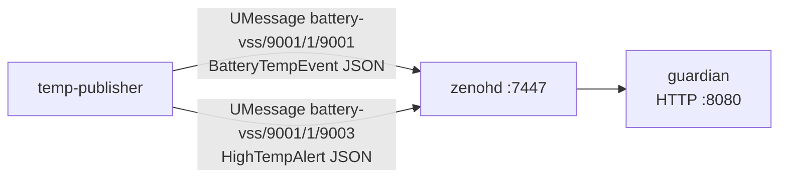
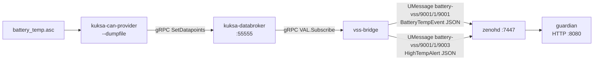
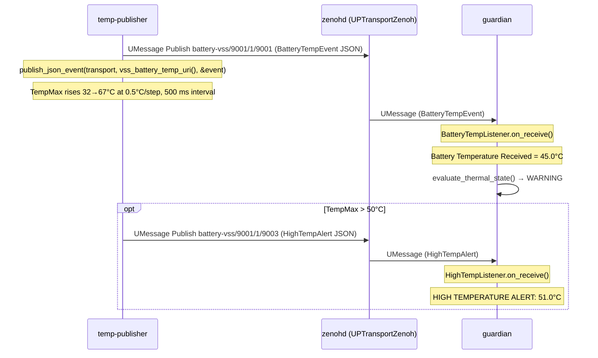
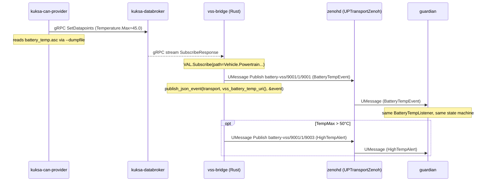
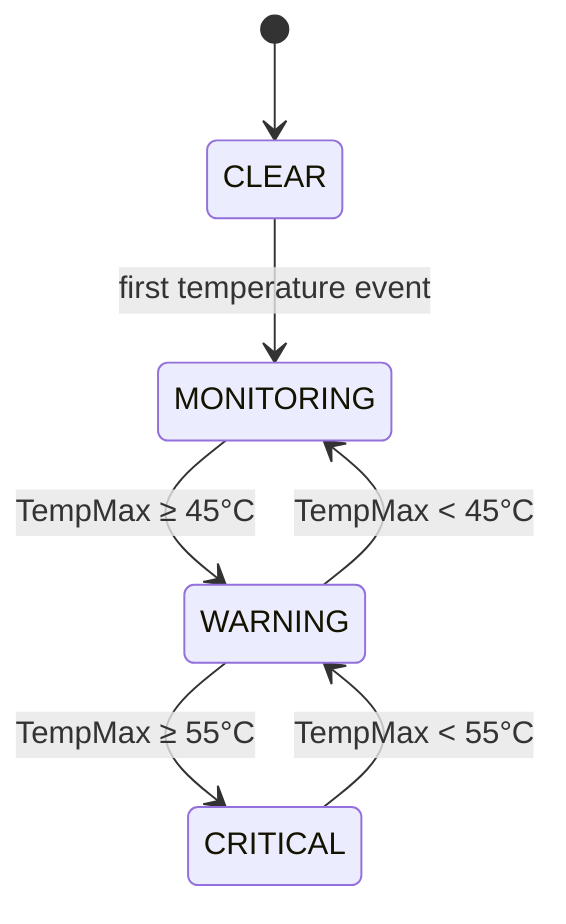

# Doctor Whodunit — Tutorial

End-to-end safety evidence pipeline: **temperature simulation → uProtocol publish →
Guardian state machine → HTTP observability**.

Two operation modes are available:

| Profile | Command | Description |
|---------|---------|-------------|
| `sim` | `docker compose --profile sim up --build` | Simulator path — no external images needed |
| `can` | `docker compose --profile can up --build` | Full CAN path — requires KUKSA images from ghcr.io |

---

## Architecture

Both paths converge on the same uProtocol topic URI over Zenoh.
Guardian subscribes via `register_listener` and is unaware of which path produced the event.

### Simulator path (`--profile sim`)



### CAN path (`--profile can`, ghcr.io required)



---

## Sequence Diagram (sim path)



## Sequence Diagram (CAN path)



---

## Components

| Container | Language | Role | Ports |
|-----------|----------|------|-------|
| `zenohd` | C (Zenoh) | uProtocol message bus (UPTransportZenoh) | TCP 7447 |
| `temp-publisher` | Rust | Publishes BatteryTempEvent via uProtocol | — |
| `guardian` | Rust | Subscribes via uProtocol, maintains thermal state | HTTP 8080 |
| `kuksa-databroker` | Rust (can profile) | VSS signal store | gRPC 55555 |
| `kuksa-can-provider` | Python (can profile) | Reads ASC replay, decodes DBC -> VSS | — |
| `vss-bridge` | Rust (can profile) | gRPC subscribe databroker, publishes via uProtocol | — |

## uProtocol Topics

| URI | Direction | Payload |
|-----|-----------|---------|
| `battery-vss/9001/1/9001` | `temp-publisher` → `guardian` | `BatteryTempEvent` JSON |
| `battery-vss/9001/1/9003` | `temp-publisher` → `guardian` | `HighTempAlert` JSON |
| `guardian-vss/9000/1/9002` | `guardian` → any | `GuardianSnapshot` JSON |

All topics are carried over Zenoh via `UPTransportZenoh`. Zenoh key expressions are
derived from the URI by the transport library — not manually specified.

---

## Guardian State Machine



| Threshold | Value | Transition |
|-----------|-------|-----------|
| WARNING | 45.0°C | MONITORING → WARNING |
| CRITICAL | 55.0°C | WARNING → CRITICAL |
| HIGH_TEMP_ALERT | 50.0°C | separate alert on `9003`, not a state |

---

## CAN Data Files

| File | Format | Description |
|------|--------|-------------|
| `can/battery_temp.asc` | Vector ASC | CAN replay log used by `--dumpfile` (no vcan0 needed) |
| `can/battery_temp.dbc` | DBC | CAN ID 0x100: CellTempMax/Avg/Min (scale 0.5, offset −40) + SoC |
| `can/vss_dbc.json` | JSON | DBC signal → VSS path mapping for kuksa-can-provider |

### DBC signals

| Signal | CAN ID | Bits | Formula | VSS path |
|--------|--------|------|---------|---------|
| `CellTempMax` | 0x100 | 16–31 LE | `raw × 0.5 − 40` | `Vehicle.Powertrain.TractionBattery.Temperature.Max` |
| `CellTempAvg` | 0x100 | 0–15 LE | `raw × 0.5 − 40` | `Vehicle.Powertrain.TractionBattery.Temperature.Average` |
| `CellTempMin` | 0x100 | 32–47 LE | `raw × 0.5 − 40` | `Vehicle.Powertrain.TractionBattery.Temperature.Min` |
| `StateOfCharge` | 0x100 | 48–63 LE | `raw × 0.5` | `Vehicle.Powertrain.TractionBattery.StateOfCharge.Current` |

---

## Quickstart

```bash
cd demo/

# First run (builds Rust containers — ~3 min)
docker compose --profile sim up --build

# Subsequent runs (no rebuild needed)
docker compose --profile sim up
```

### Check it is working

```bash
# Current guardian state
curl http://localhost:8080/state | python3 -m json.tool

# Live logs
docker compose --profile sim logs -f guardian

# Stop
docker compose --profile sim down
```

---

## Expected Output

### temp-publisher

```
INFO  Temperature Publisher  (uProtocol/Zenoh)
INFO  Topic: battery-vss/9001/1/9001
INFO  Starting temperature simulation: 32°C → 67°C at 0.5°C/step
```

### guardian

```
INFO  [Guardian] Subscribed to battery-vss/9001/1/9001 -- waiting for VSS events
INFO  [Guardian] Battery Temperature Received = 32.0C
INFO  TempMax: 32.0C | TempAvg: 30.0C | SoC: 80% | Rate: 0.00C/min -> Monitoring
...
INFO  [Guardian] Battery Temperature Received = 45.0C
INFO  TempMax: 45.0C | TempAvg: 43.0C | SoC: 77% | Rate: 60.00C/min -> Warning
...
WARN  [Guardian] HIGH TEMPERATURE ALERT: 51.0C (severity: WARNING, source: sim)
...
INFO  TempMax: 55.0C | TempAvg: 53.0C | SoC: 74% | Rate: 60.00C/min -> Critical
```

### HTTP state endpoint

```json
{
    "state": "WARNING",
    "temp_max": 47.5,
    "temp_avg": 45.5,
    "soc": 76.8,
    "timestamp_ms": 1787658818234
}
```

---

## Validation

1. Start the sim path:
   ```bash
   docker compose --profile sim up --build
   ```

2. Confirm guardian receives events:
   ```bash
   docker compose --profile sim logs -f guardian | grep "Battery Temperature Received"
   ```

3. Wait ~25 s for TempMax to cross 45°C (WARNING) and ~35 s for 55°C (CRITICAL).

4. Confirm HIGH TEMPERATURE ALERT at ~50°C:
   ```bash
   docker compose --profile sim logs -f guardian | grep "HIGH TEMPERATURE"
   ```

5. Query the HTTP state endpoint:
   ```bash
   curl http://localhost:8080/state | python3 -m json.tool
   ```

6. (CAN path — when ghcr.io accessible) Start with dumpfile replay:
   ```bash
    docker compose --profile can up --build
   docker compose --profile can logs -f kuksa-can-provider
   ```

---

## Troubleshooting

| Symptom | Cause | Fix |
|---------|-------|-----|
| Guardian not receiving events | Zenoh or uProtocol mismatch | Verify `ZENOH_CONNECT=tcp/zenohd:7447`; publisher and guardian must use the same `UUri` |
| Build fails on dep-cache step | Cargo.toml changed | Run `docker compose --profile sim build --no-cache guardian` |
| `ghcr.io` pull fails | KUKSA images unavailable | Use `--profile sim` — no external images required |
| vss-bridge exits immediately | databroker not ready | Add a startup delay or retry loop in vss_bridge.rs |
